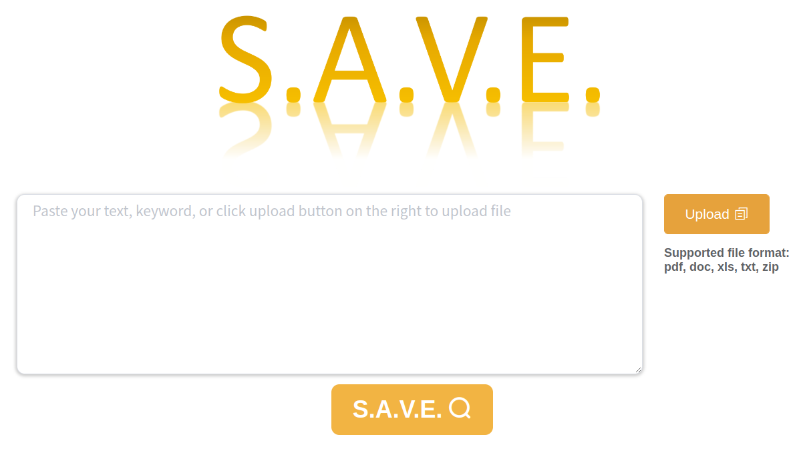

[Link to project](https://dyn.life.nthu.edu.tw/SAVE/).

S.A.V.E is a plagiarism detection search engine that respects your privacy.

Simply upload a document, and we can search the
document against our database and give you a report
with similarity score that represent the overall
percentage of similarity. All the document that user
uploaded is encrypted so you never have to worry about
privacy issue.

<figure>
  
  <figcaption style="text-align: center;">
    A Privacy-aware plagiarism dection search engine.
    <a href="https://dyn.life.nthu.edu.tw/SAVE/">Link to project.</a>
  </figcaption>
</figure>

## My Contribution

I was responsible for the optimization of document matching module.
I successfully implemented several
[FM-index](https://en.wikipedia.org/wiki/FM-index)
across the entirety of
the database's documents. The subsequent search operations yielded
remarkable outcomes, with a 100,000x increase in speed and
a substantial 60x reduction in memory consumption comparing
to the BLAST implementation.

## References

- [Full-privacy secured search engine empowered by efficient genome-mapping algorithms](https://arxiv.org/abs/2201.00696v2)

## Note

This project later led to the publication of an [IEEE paper](https://ieeexplore.ieee.org/document/10198547) and a [startup](https://www.linkedin.com/company/praexisio).
