<h3>
  <a href="https://github.com/8igMac/diglett">Link to the backend source code</a>
</h3>

<figure>
  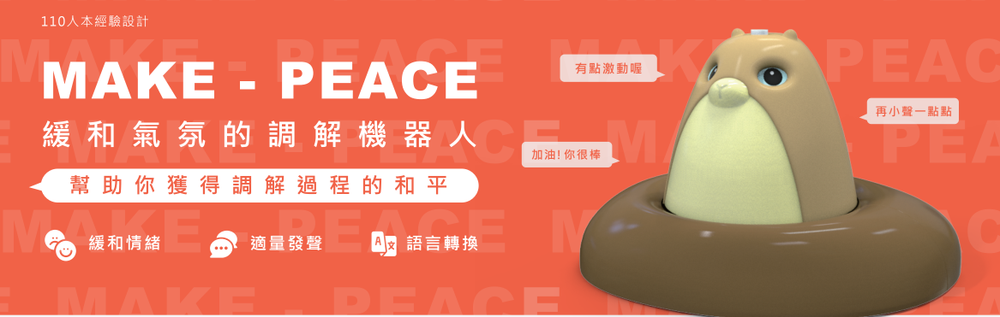
</figure>

A settlement conference is a common alternative for parties in a dispute, like after a car accident, to resolve matters outside of court. Typically, a neutral third-party mediator is present to ensure a respectful and calm atmosphere during negotiations. However, the cost of hiring such a mediator can be high.

This is where Diglett comes in. Diglett is an AI-powered mediator utilizing speech technology. It can identify speakers in a settlement conference and issue warnings if someone speaks excessively or loudly, potentially hindering others from expressing themselves. Diglett helps maintain a constructive atmosphere by ensuring everyone remains calm and respectful during the settlement process.

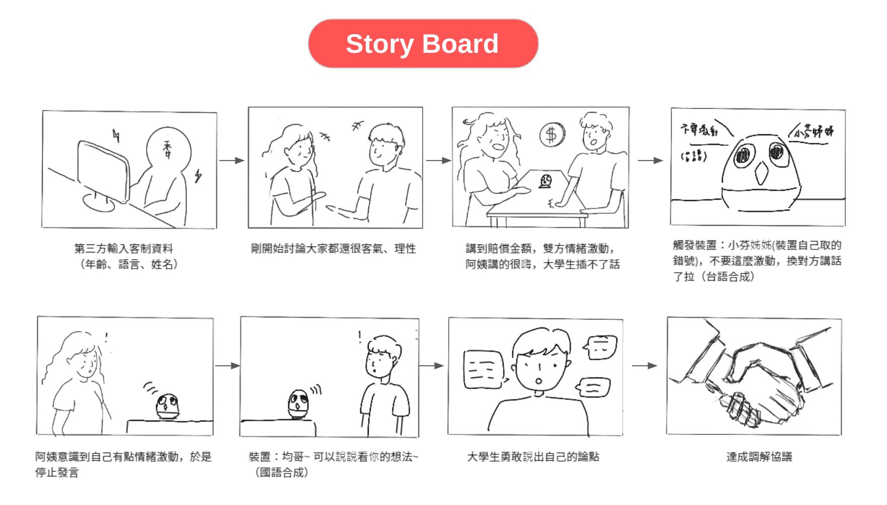

## Implementation Journey
The implementation phase was a collaborative effort involving cross-functional teams, including product designer, Raspberry Pi developer and backend developer. We established clear timelines, milestones to ensure a smooth development journey. 

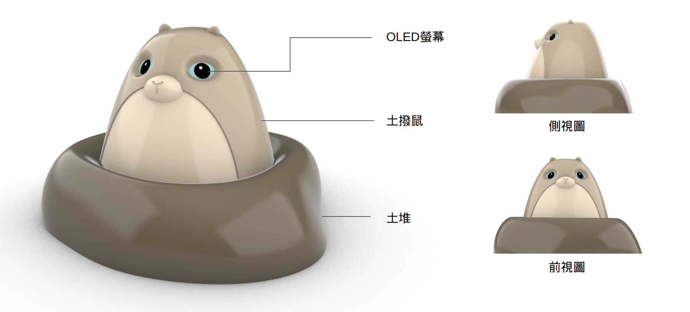

The project was split into two parts. The first involved creating the device, which consisted of a Raspberry Pi equipped with a microphone, speaker, and LED lights. This device was intended to be placed in the settlement conference room, streaming live discussions to the backend server.

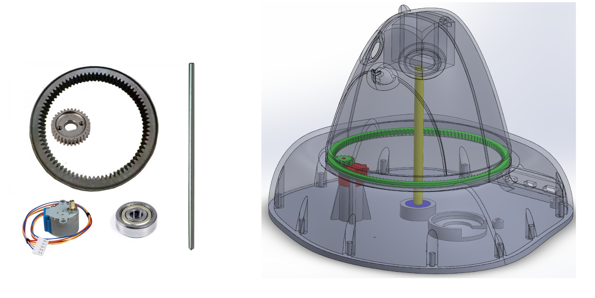
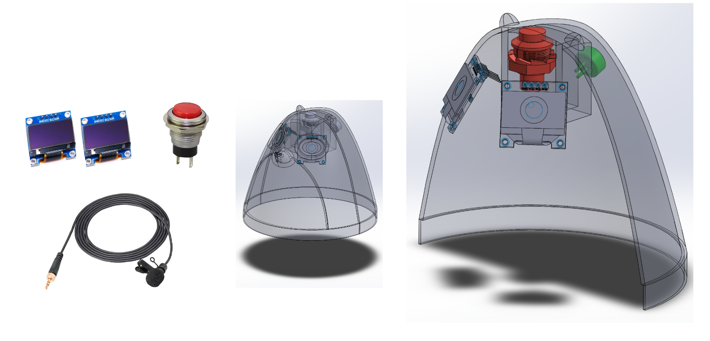
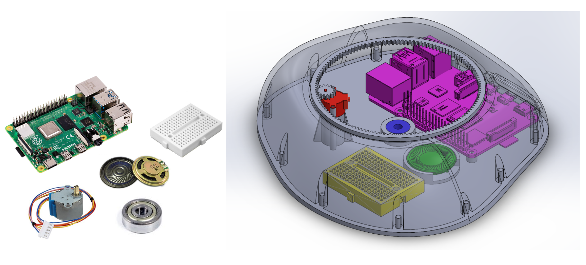

The backend server then identified the active speaker and measured their speaking volume, sending this data back to the device. We established specific thresholds to alert participants to either lower their voices or allow others to speak if they talked for too long.

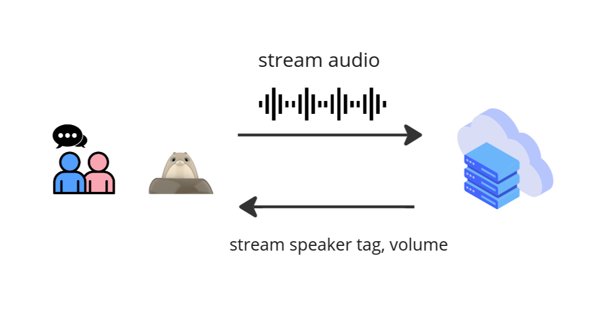

## Overcoming Challenges
Every software implementation faces challenges, and our experience with Diglett was no different. Initially, our backend design aimed to segment audio into parts with speech and silence, performing speaker recognition only on the speech segments. However, we encountered issues with the Voice Activity Detection (VAD) module not meeting our expectations. Subsequently, we devised a better approach: conducting speaker recognition on every audio segment.

This new method leverages the distinct voice patterns between speech and silence, allowing our machine learning model to effectively identify speakers. Experimental results confirmed the validity of this assumption. Ultimately, we arrived at a simpler yet highly effective solution.

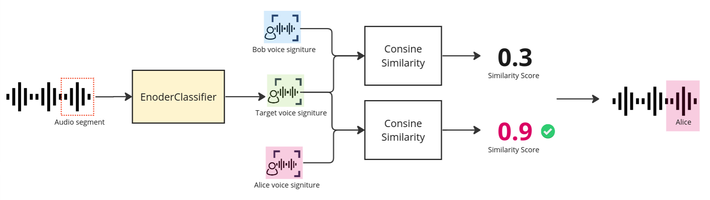

## Conclusion
In this project, we functioned as a team, handling everything from problem identification and solution design to product implementation and testing. As the backend developer, I gained valuable experience not only in implementing real-time audio streaming with websockets but also in collaborating with UI/UX designers and other software developers. It has been an incredible journey contributing to the creation of Diglett.

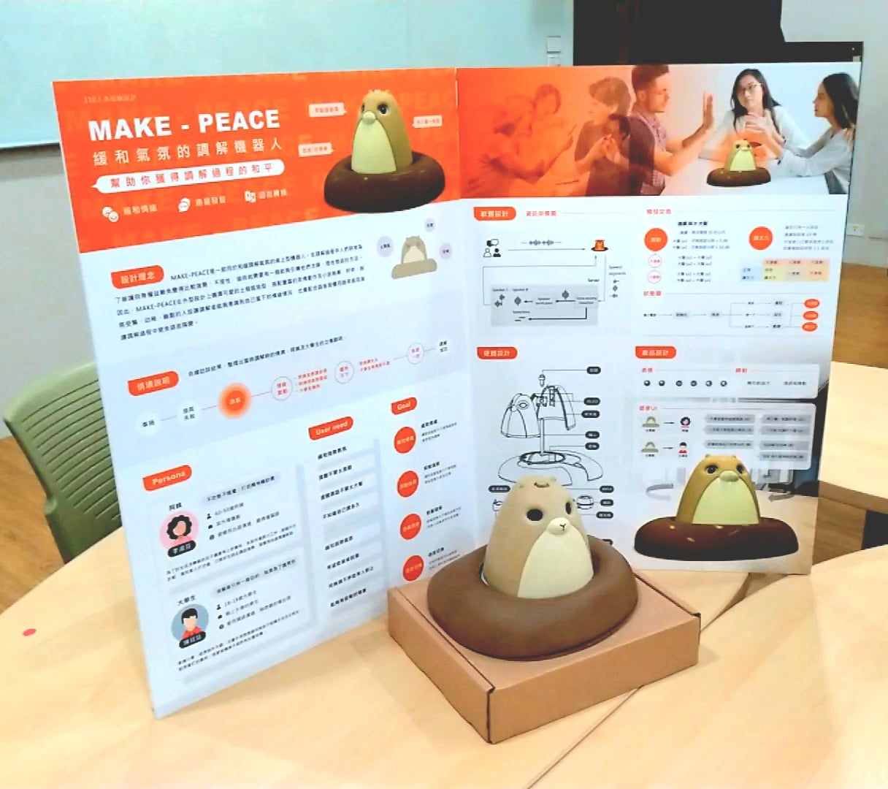

## Team
- Designers: Shao and Lin
- Raspberry Pi developer: Russell
- Backend developer: Modi

## Appendix
<figure>
  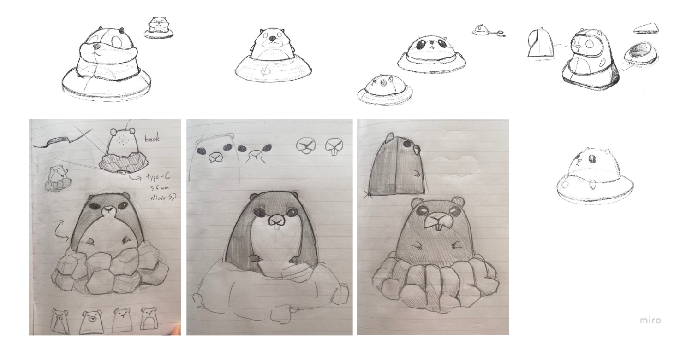
  <figcaption style="text-align: center;">
    Design draft of Diglett by our designer.
  </figcaption>
</figure>

<figure>
  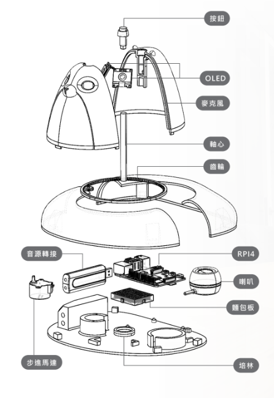
  <figcaption style="text-align: center;">
    What Diglett was made of.
  </figcaption>
</figure>
