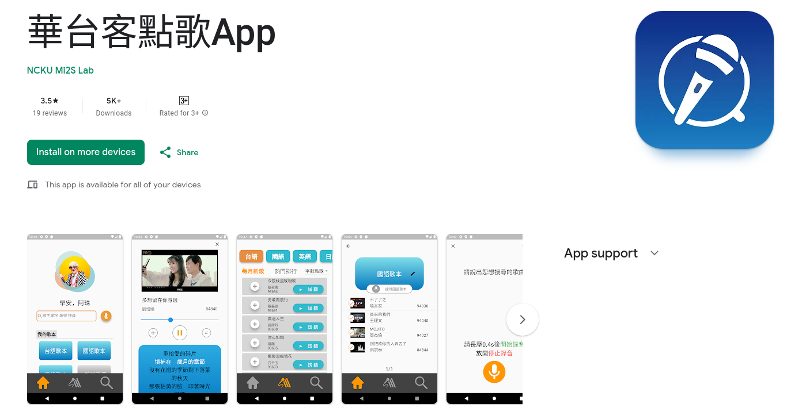

<h3>
  5000+ downloads on 
  <a href="https://play.google.com/store/apps/details?id=com.mi2s.pocket_ktv&hl=en">Google Play</a>
</h3>

<figure>
  
</figure>

Pocket KTV is a karaoke app customized for elders with the following features:
- Discover the latest trending songs or explore music categorized by language.
- Enjoy songs with dynamic, real-time lyrics.
- Search for songs using text or voice in **Minnan**, Chinese, English, or Japanese.
- Easily save or remove songs from your personal collection.

## Major Achievement
I led a team of 4 developers who have **no background in mobile development as well as no prior knowledge about Flutter**. Yet, we managed to build this project from design to shipping to end-user with-in **4.5 months and reached 5000+ downloads** (not to mention **we only work part-time**: 5-10 hours a week).

I accomplished this by:
- Organized a [Dart/Flutter study group](https://github.com/8igMac/dart_practice), enabling every team member to become proficient in the new programming language within **3 weeks**.
- Within the following **3 weeks**, the entire team became familiar with the Flutter framework and successfully **implemented basic features**, such as crafting UI pages based on Figma design specifications.
- Led scrum meetings and maintained active communication with stakeholders and the project manager to ensure focused efforts on the primary objective: **shipping the app to user to get valuable feedback**.

## My Contribution
- **Shipped 3 out of the 4 major features** (search songs, save/remove songs from user’s collections, browse songs) which consists of crafting 2 UI pages, 1 backend service (including 2 RESTful endpoints, and application containerization).
- **Optimizing song search by speech** with phonetic algorithm.
- **Testing**: Designing the end-to-end testing spec to ensure feature quality.
- **Deployment**: In charge of the deployment on Google Play and Apple testflight.
- **Take the leadership** of the development team and take responsibility of organizing the scrum, decide tech stacks, etc.
- **Communication**: talk with product owner and UI/UX designers to outline spec and decide priority of the backlog and help resolve conflict between design team and development team.
- **Participate in usuability test with user**: I am a developer who prioritizes user interaction and feedback over building features in isolation. With training in design thinking and a deep commitment to empathy and human-centered design, I actively participate in usability tests alongside UI/UX designers to observe and assist users in navigating our app. Witnessing the positive impact of my work on users' lives motivates me to create exceptional products.

## Appendix
- [自由時報: 成大開發「台華點歌APP」免費下載 搜尋歌曲說台語嘛也通](https://news.ltn.com.tw/news/life/breakingnews/4299877)
- [中央社: 成大開發「台華點歌APP」 搜尋歌曲說台語嘛會通](https://www.cna.com.tw/news/ahel/202305120180.aspx)
- [聯合報: 成大開發「台華點歌APP」 搜尋歌曲說台語嘛會通](https://udn.com/news/story/6928/7161206)
- Tech Stack
  - **Flutter** for mobile app.
  - **MySQL** for song database.
  - **Beautifulsoup** for crawler
  - RESTful API with **FastAPI (Python)**.
  - **Kaldi** for speech to text.
  - Deployed using **Docker**.
- Project milestone:
  - 2021-10-22 First commit on Dart practice
  - 2021-11-12 First commit on pktv
  - 2021-12-02 Craft 2 pages UI in pktv
  - 2022-03-16 pktv v0.1.0 internal testing #1
  - 2022-03-29 pktv v0.2.0 internal testing #2
  - 2022-04-07 pktv v0.2.1 closed alpha testing with 4 major features.